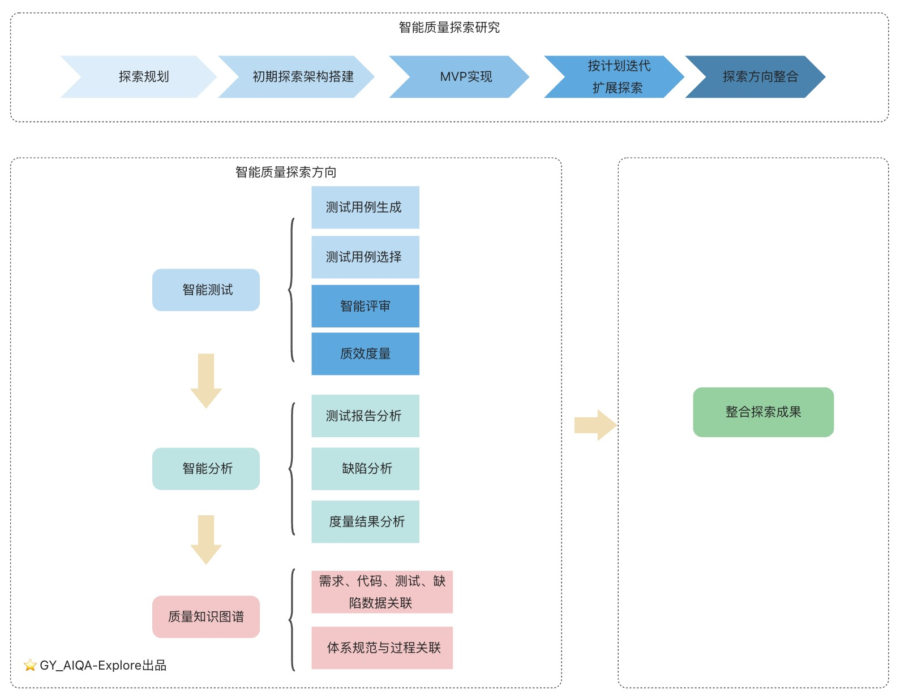

# 个人研究路线

## 项目性质声明
**这是个人研究探索的项目**
- **主导者**：10年+质量效能专家
- **性质**：系统性探索AI在质量工程中的应用
- **模式**：个人研究 + 开放协作
- **节奏**：业余时间投入，以探索研究为导向

## 研究方略
- **问题驱动**：从真实质量痛点出发，而非技术炫技
- **小步快跑**：每周都有进展，每月都有产出
- **开放透明**：记录成功与失败，分享学习探索过程
- **社区反馈**：虽为个人项目，但珍视社区建议

## 痛点问题
以金融科技行业的软件为例，在接口测试、测试/缺陷分析、数据孤岛、体系规范应用等方面都有或多或少的痛点问题。具体见[痛点问题说明](./docs/table/pain-point-problem.md)。   
本研究以痛点问题为出发点，细化规划并逐个探索：**在智能化技术加持下，如何解决问题**。

## 路线图

本项目的研究路线图如下，后续会根据探索过程阶段性更新。
（由于我个人划定一部分精力与时间来探索实践，所以探索将逐点研究与突破。侧重于个人探索研究，非生产级产品）

## 详细计划

| 阶段   | 研究分类   | 研究子分类                                      | 预估完成时间      | 备注                 | 进展      |
|------|--------|--------------------------------------------|-------------|--------------------|---------|
| 第零阶段 | 智能探索   | **探索点拆分与架构设计**                                 | 2025年12月9日  |                    | **进行中** |
| 第一阶段 | 智能测试   | 基于API文档自动分析接口测试点                           | 2025年12月15日 | 过程集成体系规范           | 未开始     |
| 第一阶段 | 智能测试   | 将测试点结合API生成接口测试用例                          | 2025年12月    | 过程集成体系规范           | 未开始     |
| 第一阶段 | 智能测试   | 将测试用例生成接口测试脚本、测试数据                         | 2025年12月    | 过程集成体系规范           | 未开始     |
| 第一阶段 | 智能测试   | 敏捷规范需求文档为下游测试提效                            | 2025年12月    |                    | 未开始     |
| 第一阶段 | 智能测试   | 基于需求分析生成接口接口测试点（思维导图）                      | 2025年12月    | 过程集成体系规范           | 未开始     |
| 第一阶段 | 智能测试   | 将测试点结合需求和API生成接口测试用例                       | 2026年1月     | 过程集成体系规范           | 未开始     |
| 第一阶段 | 智能测试   | 基于代码分析接口的测试点                               | 2026年1月     | 过程集成体系规范           | 未开始     |
| 第一阶段 | 智能测试   | 基于日志、链路生成多接口测试点                            | 2026年1月     | 过程集成体系规范           | 未开始     |
| 第一阶段 | 智能测试   | 基于设计文档（流程设计）分析业务测试点                        | 2026年1月     | 过程集成体系规范           | 未开始     |
| 第一阶段 | 智能测试   | 将测试点结合需求、设计、代码和API生成接口测试用例                 | 2026年2月     | 过程集成体系规范           | 未开始     |
| 第二阶段 | 智能评审   | 对测试点评审，包含不通过后给建议及更新生成                      | 2026年2月     | 过程集成体系规范，可多角色数字人评审 | 未开始     |
| 第二阶段 | 智能评审   | 对测试用例评审，包含不通过后给建议及更新生成                     | 2026年2月     | 过程集成体系规范，可多角色数字人评审 | 未开始     |
| 第二阶段 | 智能评审   | 对测试数据和测试脚本评审，包含不通过后给建议及更新生成                | 2026年3月     | 过程集成体系规范，可多角色数字人评审 | 未开始     |
| 第三阶段 | 智能分析   | 对接口测试结果分析                                  |             |                    | 未开始     |
| 第三阶段 | 智能分析   | 对缺陷分类标签、去重优化                               |             |                    | 未开始     |
| 第三阶段 | 智能分析   | 对缺陷根因分析                                    |             |                    | 未开始     |
| 第三阶段 | 智能分析   | 对缺陷汇总分析                                    |             |                    | 未开始     |
| 第四阶段 | 质量知识图谱 | 需求、代码、测试、缺陷数据打通关联                          |             |                    | 未开始     |
| 第四阶段 | 质量知识图谱 | **质量体系规范与过程关联**                            |             |                    | 未开始     |
| 第五阶段 | 智能测试   | 基于缺陷更新测试点、测试用例、测试脚本                        |             |                    | 未开始     |
| 第五阶段 | 智能测试   | 基于API、代码、需求、设计、链路、日志，生成复杂业务接口测试点、测试脚本、测试数据 |             |                    | 未开始     |
| 第五阶段 | 智能测试   | **变更**（接口、需求、设计、代码等）**对测试点、测试用例的影响更新**     |             |                    | 未开始     |
| 第五阶段 | 智能测试   | 智能生成的测试点、测试用例、测试数据的版本管理                    |             |                    | 未开始     |
| 第六阶段 | 整合探索   | 结合前面的探索，整合探索结果，形成生态可沉淀成果或平台                |             |                    | 未开始     |

### 说明
- 先注重验证核心框架和功能点，及简单的前端展示；后优化及完善前端技术实现。
- 后续根据实际探索情况，会阶段性更新详细计划。