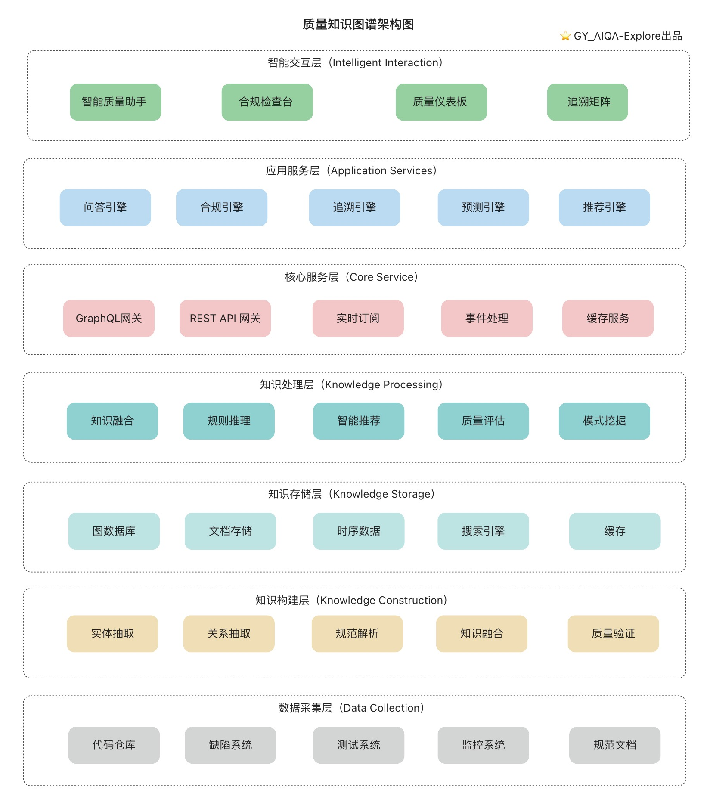

# 智能探索设计文档

## 背景
 
在梳理测试（接口测试、UI测试、性能测试等）整个过程中，会发现存在不同程度的重复性动作，需要耗费很多人力及时间成本，也存在很多痛点问题（[痛点问题说明](../table/pain-point-problem.md) ）。   
在智能化时代，我们是否可以结合智能化、自动化的能力，来为测试过程提质增效呢？
答案是肯定的，我也看到了很多质量人、测试者，都开始学习AI、应用AI，也不乏已有很多优秀实践产物。         

我探索智能测试应用的目的：
- 帮助自己在实践中学习AI技术
- 结合痛点问题（[痛点问题说明](../table/pain-point-problem.md)），以及智能化技术，寻找解决路径；
- 结合自己的多年测试、质量体系、DevOps体系平台等的经验与能力，以及AI技术，探索与沉淀下一代智能质量体系，驱动AI能力在测试过程中起到“流程驱动者”与“决策中心”的作用。

## 🚩 逐点探索
### ⭐️ 智能测试
在智能测试探索过程,优先接口测试自动生成、智能评审相关的实践。优先MVP探索验证。

#### 接口测试   
##### 1. 全局架构图

##### 2. 接口测试活动流程详设
初步规划各活动的流程设计，后续根据探索情况进行更新。

| 活动          | 输入                                                                                                                         | AI增强活动                                                      | 输出/产物                                                         | AI能力支撑                                                 | 评审点                 |
|-------------|----------------------------------------------------------------------------------------------------------------------------|-------------------------------------------------------------|---------------------------------------------------------------|--------------------------------------------------------|---------------------|
| 1.测试输入      | 1）接口文档（Swagger/openAPI）  2）需求文档  3）设计文档  4）代码  5）日志   6）知识库（业务规则&测试设计产物）  7）历史缺陷   8）测试设计的问题反馈 | 1）文档智能解析   2）接口依赖分析   3）历史模式挖掘   4）变更/问题分析      | 1）结构化接口模型   2）接口依赖关系图                                 | 1）NLP文档解析   2）信息抽取   3）依赖分析                    | 接口规范评审              |
| 2.测试点设计     | 1）结构化接口模型  2）业务规则库   3）变更范围   4）合规要求    5）测试点结构模版   6）历史测试点                                            | 1）自动生成测试点   2）智能边界值分析  3）异常场景推理                     | 1）测试点列表   2）测试点导图   3）优先级评分   4）自动化生成度评估          | 1）用例模式学习   2）边界值分析   3）异常场景推理   4）测试报告采纳情况 | 测试点覆盖评审             |
| 3.测试用例设计    | 1）测试点列表   2）测试数据模式   3）测试场景库                                                                                       | 1）自动生成测试用例  2）数据驱动扩展   3）场景组合优化                     | 1）测试用例库   2）用例 -数据映射   3） 覆盖率分析报告    4）测试点与测试用例映射 | 1）LLM生成   2）数据驱动生成   3）模式组合优化   4）模版适配     | 测试用例有效性评审           |
| 4.测试脚本与数据设计 | 1）测试用例库   2）接口定义   3）测试框架模版   4）测试数据模式    5）数据设计文档                                                             | 1）自动生成测试脚本   2）智能测试数据生成   3）依赖数据自动构造                | 1）可执行测试脚本   2）测试数据集   3）数据约束验证   4）测试点与测试用例映射     | 1）代码生成   2）模版适配   3）数据合成   4）约束            | 脚本质量评审   数据质量评审 |
| 5.测试计划与范围选择 | 1）测试用例集   2）代码变更集   3）资源约束（可选）    4）测试点、测试用例、测试脚本、测试数据的变更集                                                     | 1）自动生成测试计划  2）智能测试范围推荐  3）风险评估与优先级排序   4）执行时间预估 | 1）测试计划文档   2）执行优先级排序   3）资源分配建议（可选）                   | 1）风险预测   2）影响度分析   3）资源优化（可选）   4）时间估计     | 测试计划合理性评审           |
| 6.测试执行      | 1）测试计划   2）测试脚本集   3）测试数据集   4）环境配置                                                                            | 待规划                                                         | 1）执行结果集   2）执行日志   3）性能数据                             | 待规划                                                    | 执行过程监控评审            |
| 7.测试结果分析    | 1）执行结果集   2）系统日志   3）性能数据                                                                                          | 1）自动结果分析   2）根因自动定位   3）趋势预测分析                      | 1）测试分析报告   2）问题定位建议   3）质量趋势图                         | 1）模式识别   2）根因定位   3） 关联分析   4）趋势预测         | 分析结果准确性评审           |
| 8.缺陷分析      | 1）测试失败用例   2）系统日志   3）历史缺陷库                                                                                        | 1）自动缺陷分类   2）相似缺陷推荐   3）修复建议生成                      | 1）缺陷报告   2）修复建议  3）缺陷趋势分析                             | 1）相似缺陷检索   2）模式匹配   3）修复建议生成                   | 缺陷有效性评审             |

##### 3. AI能力支撑层
- 智能生成引擎(优先级1)
  - 文档自动解析
  - 测试点自动生成
  - 用例自动生成
  - 测试脚本自动生成
  - 测试数据自动构造
  - 报告自动生成
- 智能分析引擎（优先级3）
  - 测试结果智能分析
  - 关联智能分析
  - 根因自动定位
  - ...
- 智能评审引擎(优先级2)
  - 智能评审输入项
  - 智能评审测试点
  - 智能评审测试用例
  - 智能评审测试脚本和测试数据
  - 智能评审测试结果
  - 智能评审缺陷
- 智能优化引擎（优先级4）（结合质量知识图谱探索）
  - 测试点优化
  - 测试用例优化
  - 测试脚本优化
  - 测试数据优化
  - 报告自动优化
- 智能预测引擎（优先级5）（结合质量知识图谱探索）
  - 回归测试范围
  - 缺陷风险预测
  - 质量趋势预测
  - ...
- 智能助手（优先级6）（结合质量知识图谱探索）
  - 回答相关建议
  - 回答相关问题
  - 回答相关规范
  - 进入接口测试流程

##### 4. 详细流程
待完善

#### UI测试
待完善

### ⭐️ 质量知识图谱

#### 架构设计

### ⭐️ 质量效能度量

## 🚩 探索整合
## 全景设计图
待完善