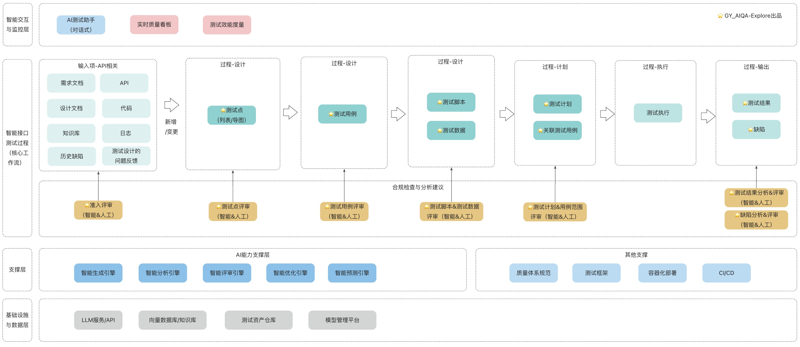

# 智能探索设计文档

## 背景
 
在梳理测试（接口测试、UI测试、性能测试等）整个过程中，会发现存在不同程度的重复性动作，需要耗费很多人力及时间成本，也存在很多痛点问题（[痛点问题说明](../architecture/pain-point-problem.md) ）。   
在智能化时代，我们是否可以结合智能化、自动化的能力，来为测试过程提质增效呢？
答案是肯定的，我也看到了很多质量人、测试者，都开始学习AI、应用AI，也不乏已有很多优秀实践产物。         

我探索智能测试应用的目的：
- 帮助自己在实践中学习AI技术
- 结合痛点问题（[痛点问题说明](../architecture/pain-point-problem.md)），以及智能化技术，寻找解决路径；
- 结合自己的多年测试、质量体系、DevOps体系平台等的经验与能力，以及AI技术，探索与沉淀下一代智能质量体系，驱动AI能力在测试过程中起到“流程驱动者”与“决策中心”的作用。

## 🚩 逐点探索
### ⭐️ 智能测试
在智能测试探索过程,优先接口测试自动生成、智能评审相关的实践。优先MVP探索验证。

#### 接口测试   
##### 1. 全局架构图

##### 2. 接口测试活动流程详设
初步规划各活动的流程设计，后续根据探索情况进行更新。

| 活动          | 输入                                                                                                                         | AI增强活动                                                      | 输出/产物                                                         | AI能力支撑                                                 | 评审点                 |
|-------------|----------------------------------------------------------------------------------------------------------------------------|-------------------------------------------------------------|---------------------------------------------------------------|--------------------------------------------------------|---------------------|
| 1.测试输入      | 1）接口文档（Swagger/openAPI）  2）需求文档  3）设计文档  4）代码  5）日志   6）知识库（业务规则&测试设计产物）  7）历史缺陷   8）测试设计的问题反馈 | 1）文档智能解析   2）接口依赖分析   3）历史模式挖掘   4）变更/问题分析      | 1）结构化接口模型   2）接口依赖关系图                                 | 1）NLP文档解析   2）信息抽取   3）依赖分析                    | 接口规范评审              |
| 2.测试点设计     | 1）结构化接口模型  2）业务规则库   3）变更范围   4）合规要求    5）测试点结构模版   6）历史测试点                                            | 1）自动生成测试点   2）智能边界值分析  3）异常场景推理                     | 1）测试点列表   2）测试点导图   3）优先级评分   4）自动化生成度评估          | 1）用例模式学习   2）边界值分析   3）异常场景推理   4）测试报告采纳情况 | 测试点覆盖评审             |
| 3.测试用例设计    | 1）测试点列表   2）测试数据模式   3）测试场景库                                                                                       | 1）自动生成测试用例  2）数据驱动扩展   3）场景组合优化                     | 1）测试用例库   2）用例 -数据映射   3） 覆盖率分析报告    4）测试点与测试用例映射 | 1）LLM生成   2）数据驱动生成   3）模式组合优化   4）模版适配     | 测试用例有效性评审           |
| 4.测试脚本与数据设计 | 1）测试用例库   2）接口定义   3）测试框架模版   4）测试数据模式    5）数据设计文档                                                             | 1）自动生成测试脚本   2）智能测试数据生成   3）依赖数据自动构造                | 1）可执行测试脚本   2）测试数据集   3）数据约束验证   4）测试点与测试用例映射     | 1）代码生成   2）模版适配   3）数据合成   4）约束            | 脚本质量评审   数据质量评审 |
| 5.测试计划与范围选择 | 1）测试用例集   2）代码变更集   3）资源约束（可选）    4）测试点、测试用例、测试脚本、测试数据的变更集                                                     | 1）自动生成测试计划  2）智能测试范围推荐  3）风险评估与优先级排序   4）执行时间预估 | 1）测试计划文档   2）执行优先级排序   3）资源分配建议（可选）                   | 1）风险预测   2）影响度分析   3）资源优化（可选）   4）时间估计     | 测试计划合理性评审           |
| 6.测试执行      | 1）测试计划   2）测试脚本集   3）测试数据集   4）环境配置                                                                            | 待规划                                                         | 1）执行结果集   2）执行日志   3）性能数据                             | 待规划                                                    | 执行过程监控评审            |
| 7.测试结果分析    | 1）执行结果集   2）系统日志   3）性能数据                                                                                          | 1）自动结果分析   2）根因自动定位   3）趋势预测分析                      | 1）测试分析报告   2）问题定位建议   3）质量趋势图                         | 1）模式识别   2）根因定位   3） 关联分析   4）趋势预测         | 分析结果准确性评审           |
| 8.缺陷分析      | 1）测试失败用例   2）系统日志   3）历史缺陷库                                                                                        | 1）自动缺陷分类   2）相似缺陷推荐   3）修复建议生成                      | 1）缺陷报告   2）修复建议  3）缺陷趋势分析                             | 1）相似缺陷检索   2）模式匹配   3）修复建议生成                   | 缺陷有效性评审             |

##### 3. AI能力支撑层
- 智能生成引擎(优先级1)
  - 文档自动解析
  - 测试点自动生成
  - 用例自动生成
  - 测试脚本自动生成
  - 测试数据自动构造
  - 报告自动生成
- 智能分析引擎（优先级3）
  - 测试结果智能分析
  - 关联智能分析
  - 根因自动定位
  - ...
- 智能评审引擎(优先级2)
  - 智能评审输入项
  - 智能评审测试点
  - 智能评审测试用例
  - 智能评审测试脚本和测试数据
  - 智能评审测试结果
  - 智能评审缺陷
- 智能优化引擎（优先级4）（结合质量知识图谱探索）
  - 测试点优化
  - 测试用例优化
  - 测试脚本优化
  - 测试数据优化
  - 报告自动优化
- 智能预测引擎（优先级5）（结合质量知识图谱探索）
  - 回归测试范围
  - 缺陷风险预测
  - 质量趋势预测
  - ...
- 智能助手（优先级6）（结合质量知识图谱探索）
  - 回答相关建议
  - 回答相关问题
  - 回答相关规范
  - 进入接口测试流程

##### 4. 详细流程
待完善

#### UI测试
待完善

### ⭐️ 质量知识图谱

#### 架构设计
构建多数据源关联（代码、缺陷、测试产物、监控、规范文档等），以实现智能问答、智能分析、度量、风险预测等。可结合质量知识图谱与精准测试，提高测试效率与质量。

### ⭐️ 质量与效能度量

对于度量，在日常研发工作中，可以从过程、产品、智能AI辅助这三方面进行评价。以下先梳理当前我对质量与效能度量的架构思考，后续在智能测试、质量知识图谱等探索基础上，再进一步地优化度量架构。

结合对于度量指标类型的分析、以及度量框架的调研分析，从全局上看有以下分类，而我将通过探索基础上，优先研究与探索智能测试相关的指标，见下述说明。

一、调研度量指标
1. 质量度量指标
- 过程质量指标

| 指标分类 | 指标名称       | 计算方式                                | 数据来源                                 | 价值分析                              | 行业标准                    | 备注 |
|------|------------|-------------------------------------|--------------------------------------|-----------------------------------|-------------------------|----|
| 需求质量 | 需求变更率      | (迭代中变更的需求数) / (总需求数)                | 需求管理工具、DevOps工具                      | 衡量需求稳定性和前期分析质量。高变更率导致浪费和延期。       | 敏捷实践、CMMI               |    |
| 需求质量 | 需求评审缺陷密度   | (评审发现的需求缺陷数) / (需求文档页数或功能点数)        | 评估需求文档质量和评审有效性。早期发现1个缺陷可节省后期10倍修复成本。 | IEEE 830、BABOK                    |                         |    |
| 设计质量 | 架构评审通过率    | (通过架构评审的设计项) / (总设计项)               | 设计评审记录                               | 确保系统架构符合非功能性要求（性能、可扩展性、安全性）       | TOGAF、SAFe              |    |
| 编码质量 | 代码评审覆盖率    | (经过代码评审的提交) / (总提交)                 | 代码工具                                 | 衡量团队代码审查文化成熟度。100%覆盖率是高质量团队的基础。   | Google工程实践              |    |
| 编码质量 | 静态代码分析违规密度 | (SonarQPM等工具发现的违规数) / (千行代码)        | CI流水线（集成SonarQube/Fortify）           | 客观衡量代码规范性和潜在缺陷。重点关注阻塞和严重级别违规。     | OWASP Top 10、CWE Top 25 |    |
| 测试质量 | 测试用例评审缺陷密度 | (评审发现的测试用例缺陷) / (测试用例数)             | 测试管理工具                               | 确保测试用例覆盖全面、设计合理。防止测试遗漏。           |                         |    |
| 测试质量 | 自动化测试稳定性   | (1 - (自动化测试失败次数中因测试脚本问题的比例)) × 100% | 自动化测试平台                              | 衡量自动化测试脚本的可靠性。低稳定性会损害团队对自动化测试的信心。 | 持续测试实践                  |    |
| 运维质量 | 变更成功率      | (成功变更数) / (总变更数)                    | 变更管理工具（ServiceNow等）                  | ITIL核心指标。衡量变更管理流程的有效性和操作规范性。      | ITIL 4、ISO 20000        |    |

- 产品质量指标（用户感知质量）

| 指标分类 | 指标名称        | 计算方式                    | 数据来源                     | 价值分析                                                | 行业标准                 | 备注 |
|------|-------------|-------------------------|--------------------------|-----------------------------------------------------|----------------------|----|
| 功能性  | 功能缺陷逃逸率     | (用户报告的缺陷数) / (总缺陷数)     | Jira/Zendesk/用户反馈系统      | 核心质量指标。衡量测试充分性和质量内建水平。【目标】 < 5%（对高可用性系统）            | 六西格玛、零缺陷管理           |    |
| 可靠性  | 服务可用性       | (系统可用时间) / (总时间) × 100% | 监控系统（Prometheus/Datadog） | SLA核心指标。直接影响用户信任和业务连续性。【目标】 99.9% - 99.999%（根据业务要求） | SLA/SLO/SLI体系        |    |
| 可靠性  | 平均无故障时间     | ∑(每次故障间隔时间) / (故障次数)    | 事件管理工具                   | 衡量系统稳定性和韧性。长MTBF表明系统设计健壮。                           | 可靠性工程                |    |
| 性能   | 核心事务P95响应时间 | 核心业务操作95%分位的响应时间        | 全链路追踪（SkyWalking/Jaeger） | 关注绝大多数用户的体验。比平均值更能揭示性能瓶颈。                           | Google SRE、性能工程      |    |
| 安全性  | 安全漏洞修复平均时间  | ∑(漏洞修复时间) / (漏洞数)       | 安全扫描工具（Nessus/Qualys）    | 衡量安全响应能力和修复效率。根据漏洞严重性分级设定SLA。                       | OWASP ASVS、ISO 27001 |    |

- 交付质量指标（发布活动质量）

| 指标分类  | 指标名称    | 计算方式                       | 数据来源                      | 价值分析                             | 行业标准           | 备注 |
|-------|---------|----------------------------|---------------------------|----------------------------------|----------------|----|
| 发布可靠性 | 部署失败率   | (导致服务降级或回滚的部署) / (总部署)     | CI/CD流水线、发布管理工具           | DORA核心指标。衡量发布流程健壮性。【目标】 < 5%     | DORA研究、持续交付    |    |
| 发布可靠性 | 回滚率     | (需要回滚的发布次数) / (总发布次数)      | 发布管理工具                    | 衡量发布版本质量和验证充分性。高回滚率损害用户信心。       | 蓝绿部署、金丝雀发布最佳实践 |    |
| 发布质量  | 发布验证通过率 | (通过所有发布验证检查的发布) / (总发布)    | 自动化验证脚本、监控告警              | 确保每次发布都经过系统化验证，避免"有缺陷的发布"。       | DevOps验证链      |    |
| 发布质量  | 配置一致性   | (生产环境与标准配置匹配的服务数) / (总服务数) | 配置管理工具（Ansible/Terraform） | 防止配置漂移导致的环境差异问题。100%一致性是可靠发布的基础。 | 基础设施即代码（IaC）   |    |

2. 效能度量指标
- 过程效能指标

| 指标分类 | 指标名称      | 计算方式                    | 数据来源                  | 价值分析                              | 行业标准               | 备注 |
|------|-----------|-------------------------|-----------------------|-----------------------------------|--------------------|----|
| 需求效能 | 需求就绪周期    | 从需求提出到需求文档完成可进入开发的平均时间  | Jira/项目管理系统           | 衡量需求分析和澄清效率。长周期会导致开发等待。           | 精益产品开发             |    |
| 需求效能 | 需求吞吐量     | 单位时间内（如每月）完成的需求点数或用户故事数 | 项目管理系统                | 衡量产品团队输出稳定性和可预测性。用于迭代规划和承诺。       | 敏捷容量规划             |    |
| 研发效能 | 开发周期时间    | 从任务分配到代码提交完成的平均时间       | Jira + Git集成          | 衡量开发实现效率。结合代码质量指标综合分析。            | Flow Metrics（流动指标） |    |
| 研发效能 | 代码提交频率    | 单位时间内的代码提交次数（按开发者或团队）   | 代码仓库                  | 衡量开发活跃度和持续集成实践。高频提交与小批量相关。        | 持续集成最佳实践           |    |
| 研发效能 | 分支存活时间    | 特性分支从创建到合并的平均天数         | 代码仓库                  | 衡量分支策略有效性。长存活时间增加合并冲突风险。【目标】 < 2天 | 主干开发（Trunk-based）  |    |
| 研发效能 | 缺陷平均修复时间  | ∑(缺陷从分配到修复的时间) / (缺陷数)  | Jira/缺陷管理系统           | 衡量开发团队响应能力和修复效率。按优先级设定不同SLA。      | 服务级别协议（SLA）        |    |
| 测试效能 | 测试环境准备时间  | 从申请测试环境到环境可用的平均时间       | 环境管理工具                | 衡量测试环境管理效率。长准备时间阻碍持续测试。           | 按需环境、容器化           |    |
| 测试效能 | 测试周期时间    | 从代码提交完成到测试通过的平均时间       | CI/CD流水线              | 衡量测试执行效率。长周期延迟反馈。                 | 持续测试、快速反馈          |    |
| 运维效能 | 故障平均响应时间  | 从故障发生到工程师开始处理的平均时间      | 监控告警系统、值班工具           | 衡量运维响应及时性。直接影响MTTR。               | SRE黄金指标            |    |
| 运维效能 | 基础设施变更成功率 | (成功的基础设施变更) / (总变更)     | Terraform/Ansible执行日志 | 衡量基础设施自动化可靠性和运维成熟度。               | GitOps、IaC成熟度模型    |    |

- 交付效能指标

| 指标分类 | 指标名称    | 计算方式                      | 数据来源           | 价值分析                                   | 行业标准                    | 备注 |
|------|---------|---------------------------|----------------|----------------------------------------|-------------------------|----|
| 价值流动 | 端到端交付周期 | 从需求确认到功能上线给用户的平均时间        | 价值流映射工具、Jira看板 | 精益核心指标。衡量组织快速交付价值的能力。【目标】 持续缩短         | Value Stream Management |    |
| 价值流动 | 流动效率    | (增值时间) / (总周期时间) × 100%   | 价值流分析          | 揭示价值流动中的浪费比例。典型软件开发的流动效率仅5-15%。        | 精益思想、价值流分析              |    |
| 价值流动 | 累积流图健康度 | 通过CFD分析在制品数量、交付速率和周期时间的关系 | 看板工具           | 可视化价值流动状态，预测交付风险和瓶颈。                   | 看板方法、约束理论               |    |
| 部署效能 | 部署频率    | 单位时间内成功发布到生产环境的次数         | CI/CD流水线       | DORA核心指标。高频率意味着小批量、低风险变更。              | DORA研究、持续交付             |    |
| 部署效能 | 变更前置时间  | 从代码提交到生产环境运行的平均时间         | Git + CI/CD流水线 | DORA核心指标。衡量自动化水平和流程效率。【目标】 < 1天（对精英团队） | DORA研究、DevOps转型         |    |
| 部署效能 | 发布协调成本	 | 发布过程中跨团队协调和手动操作所花费的时间     | 时间日志、流程分析      | 揭示组织架构和流程中的摩擦。目标是趋近于0。                 | 团队拓扑学、康威定律              |    |

3. 智能化与AI辅助指标

| 指标分类   | 指标名称      | 计算方式                        | 数据来源                              | 价值分析                  | 备注 |
|--------|-----------|-----------------------------|-----------------------------------|-----------------------|----|
| AI辅助效能 | AI代码采纳率   | (使用AI生成的代码行数) / (总代码行数)     | 代码分析工具、IDE插件日志                    | 衡量AI工具渗透深度，识别使用模式和瓶颈  |    |
| AI辅助效能 | AI建议接受率   | (接受的AI建议数) / (总AI建议数)       | GitHub Copilot/CodeWhisperer等工具日志 | 评估AI建议的相关性和准确性，优化提示工程 |    |
| AI辅助质量 | AI生成代码缺陷率 | (AI生成代码中的缺陷数) / (AI生成代码千行数) | 缺陷追踪系统 + 代码标注                     | 针对性评估AI代码质量，制定审查策略    |    |
| AI辅助效率 | AI节省时间估算  | 基于任务类型和复杂度，估算AI工具节省的时间比例    | 开发者问卷调查、时间跟踪对比                    | 量化AI工具ROI，指导投资决策      |    |
| 智能运维   | 异常自动检测率   | (系统自动检测的异常事件) / (总异常事件)     | AIOps平台、智能监控                      | 衡量运维智能化水平，减少人工监控负担    |    |
| 智能运维   | 根因分析准确率   | (准确识别根因的事件) / (总分析事件)       | AIOps平台、事件复盘                      | 评估智能诊断能力，加快故障恢复       |    |

二、 **优先探索的度量指标**

1.后续阶段，在探索智能测试、质量知识图谱基础上，结合调研的指标信息，执行以下事项：
- 划定相关过程、产品、智能化辅助的质量与效能指标的MVP范围、架构及细化研究；
- 将指标范围，根据战略层、战术层、执行层、个体层进行关注点分层，划定受众角色及数据频率。
- 对智能测试的过程和产物进行度量研究
- 迭代研究量化指标体系

2.详细计划
待完善

## 🚩 探索整合
## 全景设计图
待完善